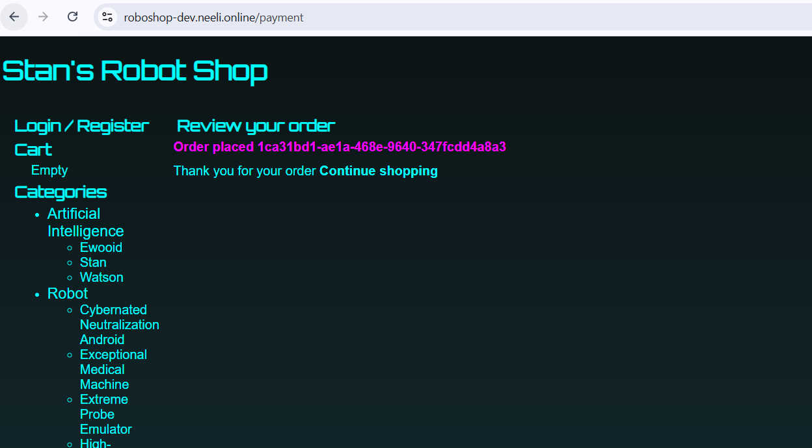
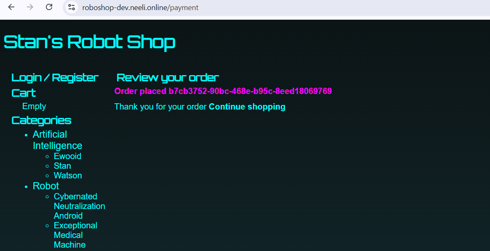

# terraform-k8-eks
This repo contains the terraform code to create AWS and K8 infrastructure

# Architecture


## VPC
- We are using the same VPC module `terraform-platform-aws-vpc` created as part of roboshop project for VM infrastructure.
- Module repository link: `https://github.com/maheshbabu22neeli/terraform-platform-aws-vpc.git`
- This module will create the below resources in AWS
  - VPC
  - Subnets (Public and Private)
  - Internet Gateway
  - NAT Gateway
  - Route Tables and Routes
```shell
Go to 00-aws-vpc directory and run the below command to create VPC

terraform init
terraform plan
terraform apply -auto-approve
```

## 05-sg
- This module will create the security groups for DB, EKS Control Plane, EKS Worker Nodes and ALB
- We are using the same SG module `terraform-platform-aws-sg` created as part of roboshop project for VM infrastructure.
- Module repository link: `https://github.com/maheshbabu22neeli/terraform-platform-aws-sg.git`
```shell
Go to 05-sg directory and run the below command to create security groups
terraform init
terraform plan
terraform apply -auto-approve
```

## 20-rds
- This module will create the RDS instance for MySql database.
- We are using the K8 RDS module `source = "terraform-aws-modules/rds/aws"` to create RDS instance.
- Once MSQL RDS Created, we have to add the data to the database. 
- To do that we have to connect to the RDS instance using the EC2 bastion server.
```shell
Firstly transfer all the data files from Local to Bastion Server
> scp app-user.sql master-data.sql ec2-user@13.220.144.75:/tmp

Secondly, go to bastion and run the below command to connect to RDS instance and load the data to MySql database
Install mysql client in bastion server
sudo dnf install mysql -y
mysql -h roboshop-dev.c2ncquyas938.us-east-1.rds.amazonaws.com -u root -pRoboShop#1234 < app-user.sql
mysql -h roboshop-dev.c2ncquyas938.us-east-1.rds.amazonaws.com -u root -pRoboShop#1234 < master-data.sql

$ mysql -h roboshop-dev.c2ncquyas938.us-east-1.rds.amazonaws.com -u root -pRoboShop#1234
mysql: [Warning] Using a password on the command line interface can be insecure.
Welcome to the MySQL monitor.  Commands end with ; or \g.
Your MySQL connection id is 131
Server version: 8.0.45 Source distribution

Copyright (c) 2000, 2026, Oracle and/or its affiliates.

Oracle is a registered trademark of Oracle Corporation and/or its
affiliates. Other names may be trademarks of their respective
owners.

Type 'help;' or '\h' for help. Type '\c' to clear the current input statement.

mysql> show databases;
+--------------------+
| Database           |
+--------------------+
| cities             |
| information_schema |
| mysql              |
| performance_schema |
| sys                |
+--------------------+
5 rows in set (0.08 sec)

mysql> use cities;
Reading table information for completion of table and column names
You can turn off this feature to get a quicker startup with -A

Database changed
mysql> show tables;
+------------------+
| Tables_in_cities |
+------------------+
| cities           |
| codes            |
+------------------+
2 rows in set (0.09 sec)

```

## 25-custom-eks
- This module will create the EKS cluster using the "terraform-platform-aws-eks" module.
- This module contains all the necessary configurations for applications, namespace, databases, frontend, and backend.
- Before running custom-eks module, make sure you have already run bastion configuration.
- Bastion configuration will create all the necessary tools to connect and play with eks cluster
- After login to bastion server, run the below command to connect to EKS cluster
```shell
aws configure
aws eks update-kubeconfig --name roboshop-dev --region us-east-1
kubectl get nodes
```

Now try to load database prerequisites data to MySql service using the below command
```shell
Firstly we require statefulset, headless service, normal service, PV , PVC and Storage Class.
Secondsly, In order to do EBS dynamic provisioning, we need to create Storage Class and PV and PVC.
Finally, we can create the statefulset and services for MySql database.

To do all we need drviers called EBSDriver 

helm repo add aws-ebs-csi-driver https://kubernetes-sigs.github.io/aws-ebs-csi-driver
helm repo update
helm upgrade --install aws-ebs-csi-driver aws-ebs-csi-driver/aws-ebs-csi-driver --namespace kube-system

drivers installed

````

### Create Databases
```shell
Now, 
1. Create Namespace
kubectl apply -f 25-custom-eks/app/00-namespace/namespace.yaml

2. Create Storage Class
kubectl apply -f 25-custom-eks/app/01-storage-class/storage-class.yaml

3. Create remaining databases
3.1 Create Mongo DB
kubectl apply -f 25-custom-eks/app/02-databases/mongodb/manifest.yaml
kubectl apply -f 25-custom-eks/app/02-databases/redis/manifest.yaml
kubectl apply -f 25-custom-eks/app/02-databases/rabbitmq/manifest.yaml

````

### Create Backend
```shell
Go to
cd 25-custom-eks/app/03-backend

4.0 Create Debug
kubectl apply -f manifest.yaml

4.1 Create Catalogue
helm upgrade --install catalogue .

4.2 Create User
helm upgrade --install user .

4.3 Create Cart
helm upgrade --install cart .

4.4 Create Shipping
helm upgrade --install shipping .

4.5 Create Payment
helm upgrade --install payment .

```

### Create Frontend using Ingress and ServiceAccount
1. We need OIDC (OpenIDConnect) provider to be enabled in the cluster to use IAM roles for Service Accounts (IRSA) in EKS.
2. Create IAM role and attach permissions to the role
3. Create Service Account
4. Install AWS Load Balancer Controller drivers using Helm and specify the Service Account created in the previous step
5. Run POD with the Service Account
6. This allows the Service Account to assume the IAM role and access AWS resources securely without needing to manage long-term credentials.

#### Create OIDC provider
```shell
3.91.206.107 | 10.0.1.25 | t3.micro | null
[ ec2-user@ip-10-0-1-25 ~ ]$ curl -o iam-policy.json https://raw.githubusercontent.com/kubernetes-sigs/aws-load-balancer-controller/v3.2.1/docs/install/iam_policy.json
  % Total    % Received % Xferd  Average Speed   Time    Time     Time  Current
                                 Dload  Upload   Total   Spent    Left  Speed
100  8955  100  8955    0     0  91377      0 --:--:-- --:--:-- --:--:-- 92319
```

#### Create IAM Policy
```shell
3.91.206.107 | 10.0.1.25 | t3.micro | null
[ ec2-user@ip-10-0-1-25 ~ ]$ aws iam create-policy \
    --policy-name AWSLoadBalancerControllerIAMPolicy \
    --policy-document file://iam-policy.json
{
    "Policy": {
        "PolicyName": "AWSLoadBalancerControllerIAMPolicy",
        "PolicyId": "ANPAS7GGOGYBGOYINQJTU",
        "Arn": "arn:aws:iam::<AWS_ACCOUNT>:policy/AWSLoadBalancerControllerIAMPolicy",
        "Path": "/",
        "DefaultVersionId": "v1",
        "AttachmentCount": 0,
        "PermissionsBoundaryUsageCount": 0,
        "IsAttachable": true,
        "CreateDate": "2026-04-26T07:37:09+00:00",
        "UpdateDate": "2026-04-26T07:37:09+00:00"
    }
}
```

#### Create Service Account
```shell
[ ec2-user@ip-10-0-1-25 ~ ]$ eksctl create iamserviceaccount \
  --cluster=roboshop-dev \
  --namespace=kube-system \
  --name=aws-load-balancer-controller \
  --attach-policy-arn=arn:aws:iam::204427113986:policy/AWSLoadBalancerControllerIAMPolicy \
  --override-existing-serviceaccounts \
  --region us-east-1 \
  --approve
2026-04-26 07:40:40 [ℹ]  1 iamserviceaccount (kube-system/aws-load-balancer-controller) was included (based on the include/exclude rules)
2026-04-26 07:40:40 [!]  metadata of serviceaccounts that exist in Kubernetes will be updated, as --override-existing-serviceaccounts was set
2026-04-26 07:40:40 [ℹ]  1 task: {
    2 sequential sub-tasks: {
        create IAM role for serviceaccount "kube-system/aws-load-balancer-controller",
        create serviceaccount "kube-system/aws-load-balancer-controller",
    } }2026-04-26 07:40:40 [ℹ]  building iamserviceaccount stack "eksctl-roboshop-dev-addon-iamserviceaccount-kube-system-aws-load-balancer-controller"
2026-04-26 07:40:40 [ℹ]  deploying stack "eksctl-roboshop-dev-addon-iamserviceaccount-kube-system-aws-load-balancer-controller"
2026-04-26 07:40:40 [ℹ]  waiting for CloudFormation stack "eksctl-roboshop-dev-addon-iamserviceaccount-kube-system-aws-load-balancer-controller"
2026-04-26 07:41:10 [ℹ]  waiting for CloudFormation stack "eksctl-roboshop-dev-addon-iamserviceaccount-kube-system-aws-load-balancer-controller"
2026-04-26 07:41:10 [ℹ]  created serviceaccount "kube-system/aws-load-balancer-controller"


Command to delete any existing ServiceAccount
eksctl delete iamserviceaccount \
  --cluster=roboshop-dev \
  --namespace=kube-system \
  --name=aws-load-balancer-controller
```
#### Create AWS Load Balancer Controller using Helm
```shell
3.91.206.107 | 10.0.1.25 | t3.micro | null
[ ec2-user@ip-10-0-1-25 ~ ]$ helm repo add eks https://aws.github.io/eks-charts
"eks" has been added to your repositories

3.91.206.107 | 10.0.1.25 | t3.micro | null
[ ec2-user@ip-10-0-1-25 ~ ]$ helm repo update
Hang tight while we grab the latest from your chart repositories...
...Successfully got an update from the "aws-ebs-csi-driver" chart repository
...Successfully got an update from the "eks" chart repository
Update Complete. ⎈Happy Helming!⎈

3.91.206.107 | 10.0.1.25 | t3.micro | null
[ ec2-user@ip-10-0-1-25 ~ ]$ helm install aws-load-balancer-controller eks/aws-load-balancer-controller \
  -n kube-system \
  --set clusterName=roboshop-dev \
  --set serviceAccount.create=false \
  --set serviceAccount.name=aws-load-balancer-controller
NAME: aws-load-balancer-controller
LAST DEPLOYED: Sun Apr 26 07:46:10 2026
NAMESPACE: kube-system
STATUS: deployed
REVISION: 1
TEST SUITE: None
NOTES:
AWS Load Balancer controller installed!

```

#### Run Frontend POD
```shell
$ helm upgrade --install frontend .
Release "frontend" does not exist. Installing it now.
NAME: frontend
LAST DEPLOYED: Sun Apr 26 08:13:48 2026
NAMESPACE: default
STATUS: deployed
REVISION: 1
TEST SUITE: None
``````

#### Create record in route53
```shell
Go to loadbalancer and fetch the DNS name and create a record in route53 with the same DNS name

And hit the given url in browser to access the frontend application
https://roboshop-dev.neeli.online/
```



### Create AWS Load balancer using Gateway
1. In the above Ingress control way of creation to ALB is a bit tricky and Engineers has to maintain all the k8 admin tasks. 
2. In order to overcome the engineer burden and to have clear roles between admin and engineer, they have introduced Gateway controller.
3. This can be achieved by
#### Admin Tasks
- Gateway Class                 -> tells which load balancer to use
- Load Balancer Configuration   -> Internal/Intenet
- Gateway Configuration         -> tells about listener

#### Engineer Tasks
- TargetGroup Configuration
- HttpRoute

#### Steps to achieve Gateway Controller
```shell
1. Delete existing Ingress from the K8
   Open k9s toll and select roboshop namespace
   Now, do a get using shift+: and type ingress, it will show ingress details.
   Click on ctrl+d to delete
   
2. Uninstall Drivers
   helm uninstall aws-load-balancer-controller eks/aws-load-balancer-controller -n kube-system
   
3. Install gateway-api new Kind standards
    kubectl apply --server-side=true -f https://github.com/kubernetes-sigs/gateway-api/releases/download/v1.5.0/standard-install.yaml
    
4. Install AWS Load Balancer Controller
  VPC_ID=$(aws ssm get-parameter --name /roboshop-dev/vpc_id \
  --region us-east-1 --query Parameter.Value --output text)
  
  helm upgrade --install aws-load-balancer-controller eks/aws-load-balancer-controller \
  -n kube-system \
  --set clusterName=roboshop-dev \
  --set serviceAccount.create=false \
  --set serviceAccount.name=aws-load-balancer-controller \
  --set region=us-east-1 \
  --set vpcId=$VPC_ID \
  --set controllerConfig.featureGates.ALBGatewayAPI=true \
  --set controllerConfig.featureGates.NLBGatewayAPI=true

  kubectl rollout status deployment aws-load-balancer-controller -n kube-system
  
  kubectl get pods -n kube-system | grep aws-load-balancer
  
5. Now configure frontend application using gatway
3.91.206.107 | 10.0.1.25 | t3.micro | https://github.com/maheshbabu22neeli/terraform-k8-roboshop-infra.git
[ ec2-user@ip-10-0-1-25 ~/terraform-k8-roboshop-infra/25-custom-eks/app/05-frontend-gateway ]$ kubectl apply -f 01-gateway-class.yaml
gatewayclass.gateway.networking.k8s.io/roboshop-aws-alb created

3.91.206.107 | 10.0.1.25 | t3.micro | https://github.com/maheshbabu22neeli/terraform-k8-roboshop-infra.git
[ ec2-user@ip-10-0-1-25 ~/terraform-k8-roboshop-infra/25-custom-eks/app/05-frontend-gateway ]$ kubectl apply -f 02-loadbalancerconfiguration.yaml
loadbalancerconfiguration.gateway.k8s.aws/roboshop-aws-alb-config created

3.91.206.107 | 10.0.1.25 | t3.micro | https://github.com/maheshbabu22neeli/terraform-k8-roboshop-infra.git
[ ec2-user@ip-10-0-1-25 ~/terraform-k8-roboshop-infra/25-custom-eks/app/05-frontend-gateway ]$ kubectl apply -f 03-gateway.yaml
gateway.gateway.networking.k8s.io/roboshop-gateway created

3.91.206.107 | 10.0.1.25 | t3.micro | https://github.com/maheshbabu22neeli/terraform-k8-roboshop-infra.git
[ ec2-user@ip-10-0-1-25 ~/terraform-k8-roboshop-infra/25-custom-eks/app/05-frontend-gateway ]$ kubectl apply -f 04-frontend.yaml
targetgroupconfiguration.gateway.k8s.aws/frontend-tgconfig created
httproute.gateway.networking.k8s.io/frontend-route created

Create alias record in Rout53 and access the application using "https://roboshop-dev.neeli.online/"
```


#### Drawbacks from above implementations
- Why kubernetes is creating all the AWS ALB, Listener, Rules, and TargetGroup
- These can be created easily by using terraform
- We can have more control on our side part of work


# Create Frontend by AWS terraform 
1. Create ALB
2. Create Listener
3. Create Rule
4. Create TargetGroup
5. Then just add TargetGroupBinding to attach pods

Before that we are cleaning all the resources created from above gateway approach
# Deploying RoboShop on AWS EKS — A Step-by-Step Story
> *Date: 27 April 2026 | Environment: AWS EKS (us-east-1) | App: RoboShop*
----
🏗️ RoboShop — AWS Infrastructure with Terraform
> End-to-end AWS infrastructure for the RoboShop e-commerce platform, provisioned using Terraform modules in a numbered, sequential order.
---
📁 Repository Structure
```
terraform-k8-roboshop-infra/
├── 00-vpc/           # VPC, subnets, route tables, IGW, NAT
├── 05-sg/            # Security Groups (base)
├── 10-sg-rules/      # Security Group Rules
├── 15-bastion/       # Bastion Host (EC2)
├── 20-rds/           # Amazon RDS (MySQL)
├── 23-acm/           # AWS Certificate Manager (SSL/TLS)
├── 25-custom-eks/    # EKS Cluster (custom node groups)
└── 35-frontend-alb/  # Application Load Balancer (Frontend)
```
> ⚠️ **Important:** Always apply modules in the numbered order listed above. Each module depends on outputs from the previous one.
---
✅ Prerequisites
Before running any Terraform commands, make sure you have the following set up:
Terraform `>= 1.0`
AWS CLI configured with appropriate credentials
IAM user/role with permissions for VPC, EC2, RDS, EKS, ACM, and ALB
An S3 backend bucket (if remote state is configured)
```bash
aws configure
```
---
🚀 Step-by-Step Deployment
Step 1 — VPC (`00-vpc`)
Creates the foundational network layer: VPC, public/private subnets, Internet Gateway, NAT Gateway, and route tables.
```bash
cd 00-vpc/
terraform init
terraform apply -auto-approve
```
Resources created:
VPC
Public & Private Subnets (multi-AZ)
Internet Gateway
NAT Gateway
Route Tables & Associations
---
Step 2 — Security Groups (`05-sg`)
Creates all base Security Groups without rules. Rules are managed separately to avoid circular dependencies.
```bash
cd ../05-sg/
terraform init
terraform apply -auto-approve
```
Resources created:
Security Groups for: ALB, EKS, RDS, Bastion
---
Step 3 — Security Group Rules (`10-sg-rules`)
Attaches inbound and outbound rules to the Security Groups created in Step 2.
```bash
cd ../10-sg-rules/
terraform init
terraform apply -auto-approve
```
Resources created:
Ingress & Egress rules for all Security Groups
Cross-SG references (e.g. EKS → RDS, ALB → EKS)
---
Step 4 — Bastion Host (`15-bastion`)
Provisions a Bastion EC2 instance in the public subnet for secure SSH access to private resources.
```bash
cd ../15-bastion/
terraform init
terraform apply -auto-approve
```
Resources created:
EC2 instance (Bastion Host) in public subnet
Associated with Bastion Security Group
---
Step 5 — RDS MySQL (`20-rds`)
Provisions an Amazon RDS MySQL instance in the private subnet for relational data storage.
```bash
cd ../20-rds/
terraform init
terraform apply -auto-approve
```
Resources created:
RDS MySQL instance (private subnet)
DB Subnet Group
Parameter Group
> 💡 Note the RDS endpoint from the output — it is used later when seeding data via the MySQL client.
---
Step 6 — ACM SSL Certificate (`23-acm`)
Requests and validates an SSL/TLS certificate via AWS Certificate Manager for HTTPS on the ALB.
```bash
cd ../23-acm/
terraform init
terraform apply -auto-approve
```
Resources created:
ACM Certificate (DNS validated)
Route 53 validation records (if applicable)
---
Step 7 — EKS Cluster (`25-custom-eks`)
Provisions a fully managed EKS cluster with custom node groups in private subnets.
```bash
cd ../25-custom-eks/
terraform init
terraform apply -auto-approve
```
Resources created:
EKS Control Plane
Managed Node Groups (private subnets)
IAM Roles & Policies for EKS
OIDC Provider (for IRSA)
> 💡 After apply, update your kubeconfig to start using `kubectl`:
> ```bash
> aws eks update-kubeconfig --name roboshop-dev --region us-east-1
> ```
---
Step 8 — Frontend ALB (`35-frontend-alb`)
Provisions the Application Load Balancer that routes public HTTPS traffic to the RoboShop frontend running on EKS.
```bash
cd ../35-frontend-alb/
terraform init
terraform apply -auto-approve
```
Resources created:
Application Load Balancer (public subnets)
HTTPS Listener (uses ACM certificate from Step 6)
HTTP → HTTPS redirect
Target Group (forwards to EKS frontend service)
---
🗑️ Teardown (Destroy All Resources)
---
Destroy resources in reverse order to avoid dependency errors:
```bash
cd 35-frontend-alb/ && terraform destroy -auto-approve
cd ../25-custom-eks/ && terraform destroy -auto-approve
cd ../23-acm/        && terraform destroy -auto-approve
cd ../20-rds/        && terraform destroy -auto-approve
cd ../15-bastion/    && terraform destroy -auto-approve
cd ../10-sg-rules/   && terraform destroy -auto-approve
cd ../05-sg/         && terraform destroy -auto-approve
cd ../00-vpc/        && terraform destroy -auto-approve
```
> ⚠️ **RDS Snapshots:** AWS may retain final snapshots after RDS is destroyed. Delete them manually if needed:
> ```bash
> aws rds delete-db-snapshot --db-snapshot-identifier <snapshot-id>
> ```
---
🗺️ Architecture Overview
---
```
Internet
    │
    ▼
[ ALB - 35-frontend-alb ]  ← HTTPS (ACM cert from 23-acm)
    │
    ▼
[ EKS Cluster - 25-custom-eks ]  (private subnets)
    │           │
    ▼           ▼
[ RDS MySQL ] [ MongoDB / Redis / RabbitMQ ]
  20-rds         (deployed via Helm on EKS)
    │
[ Bastion Host - 15-bastion ] ← SSH access
    │
[ VPC - 00-vpc ]
[ Security Groups - 05-sg + 10-sg-rules ]
```
---
📋 Module Summary
---
````
Step	Module	Key Resource
1	`00-vpc`	VPC, Subnets, IGW, NAT
2	`05-sg`	Security Groups
3	`10-sg-rules`	SG Ingress/Egress Rules
4	`15-bastion`	Bastion EC2 Host
5	`20-rds`	RDS MySQL Instance
6	`23-acm`	ACM SSL Certificate
7	`25-custom-eks`	EKS Cluster & Node Groups
8	`35-frontend-alb`	Application Load Balancer
````
---

Infrastructure for RoboShop on AWS — provisioned with Terraform
---

## Chapter 1: Waking Up the Cluster
After a long gap since the last system update back in January, it was time to get back to work. The engineer cleared the terminal and set the stage for a full application deployment.
The mission: deploy the RoboShop e-commerce application onto a custom AWS EKS Kubernetes cluster.
First, AWS credentials were configured and the kubeconfig was updated to point `kubectl` at the right cluster:
```bash
aws configure
aws eks update-kubeconfig --name roboshop-dev --region us-east-1
```
The cluster `roboshop-dev` in `us-east-1` was now accessible.
---
## Chapter 2: Getting the Code
With cluster access confirmed, the infrastructure manifests and Helm charts were pulled down from GitHub:
```bash
git clone https://github.com/maheshbabu22neeli/terraform-k8-roboshop-infra.git
cd terraform-k8-roboshop-infra/25-custom-eks/app
ls -la
```
The repo contained a well-structured directory layout under `25-custom-eks/app/`, with numbered folders guiding the deployment order — from namespaces and storage all the way through to the frontend.
---
## Chapter 3: Laying the Foundations — Namespace & Storage
Every good Kubernetes deployment starts with a namespace to keep workloads organised and isolated.
```bash
cd 00-namespace/
kubectl apply -f namespace.yaml
```
Next came storage. RoboShop's databases need persistent volumes, so the AWS EBS CSI Driver was installed to provision EBS volumes dynamically:
```bash
helm repo add aws-ebs-csi-driver https://kubernetes-sigs.github.io/aws-ebs-csi-driver
helm repo update
helm upgrade --install aws-ebs-csi-driver aws-ebs-csi-driver/aws-ebs-csi-driver --namespace kube-system
```
With the driver in place, a custom StorageClass was applied to define how EBS volumes should be provisioned:
```bash
cd ../01-storage-class/
kubectl apply -f ebs-storage-class.yaml
```
The cluster now had a solid storage foundation ready for stateful workloads.
---
## Chapter 4: Standing Up the Databases
RoboShop relies on three databases, each serving a distinct role in the application:
```bash
kubectl apply -f 25-custom-eks/app/02-databases/mongodb/manifest.yaml
kubectl apply -f 25-custom-eks/app/02-databases/redis/manifest.yaml
kubectl apply -f 25-custom-eks/app/02-databases/rabbitmq/manifest.yaml
```
Database	Role
MongoDB	Product catalogue and user data
Redis	Session caching and cart data
RabbitMQ	Async messaging between services
All three were deployed as Kubernetes StatefulSets, backed by the EBS StorageClass configured in the previous step.
---
## Chapter 5: Deploying the Backend Microservices
With the databases running, it was time to bring up the backend services. First, a debug pod was deployed — a handy utility for troubleshooting connectivity inside the cluster:
```bash
cd 25-custom-eks/app/03-backend/debug/
kubectl apply -f manifest.yaml
```
Then each microservice was deployed using Helm:
🗂 Catalogue Service
```bash
cd ../catalogue/
helm upgrade --install catalogue .
```
👤 User Service
```bash
cd ../user/
helm upgrade --install user .
```
🛒 Cart Service
```bash
cd ../cart/
helm upgrade --install cart .
```
📦 Shipping Service
```bash
cd ../shipping/
helm upgrade --install shipping .
```
💳 Payment Service
```bash
cd ../payment/
helm upgrade --install payment .
```
All five core backend services were now running in the cluster.
---
## Chapter 6: Seeding the MySQL Database (RDS)
RoboShop uses Amazon RDS (MySQL) for relational data — specifically for user accounts and master data like product catalogue and pricing. The MySQL client was installed and the seed scripts were loaded into the RDS instance:
```bash
sudo dnf install mysql -y

# Load application user schema
mysql -h roboshop-dev.c2ncquyas938.us-east-1.rds.amazonaws.com \
      -u root -pRoboShop#1234 < app-user.sql

# Load master data (products, prices, etc.)
mysql -h roboshop-dev.c2ncquyas938.us-east-1.rds.amazonaws.com \
      -u root -pRoboShop#1234 < master-data.sql
```
The RDS instance was now fully populated with all the data the backend services needed to function correctly.
---
## Chapter 7: Setting Up the AWS Load Balancer Controller
To expose the application to the internet via an AWS Application Load Balancer (ALB), the AWS Load Balancer Controller was installed. This required an IAM policy and a Kubernetes service account linked to AWS via IRSA (IAM Roles for Service Accounts).
Step 1 — Download the IAM policy:
```bash
curl -o iam-policy.json \
  https://raw.githubusercontent.com/kubernetes-sigs/aws-load-balancer-controller/v3.2.1/docs/install/iam_policy.json
```
Step 2 — Create the IAM policy in AWS:
```bash
aws iam create-policy \
    --policy-name AWSLoadBalancerControllerIAMPolicy \
    --policy-document file://iam-policy.json
```
Step 3 — Create the IRSA service account:
```bash
eksctl create iamserviceaccount \
  --cluster=roboshop-dev \
  --namespace=kube-system \
  --name=aws-load-balancer-controller \
  --attach-policy-arn=arn:aws:iam::204427113986:policy/AWSLoadBalancerControllerIAMPolicy \
  --override-existing-serviceaccounts \
  --region us-east-1 \
  --approve
```
Step 4 — Install the controller via Helm:
```bash
helm repo add eks https://aws.github.io/eks-charts
helm repo update

helm install aws-load-balancer-controller eks/aws-load-balancer-controller \
  -n kube-system \
  --set clusterName=roboshop-dev \
  --set serviceAccount.create=false \
  --set serviceAccount.name=aws-load-balancer-controller
```
The AWS Load Balancer Controller was now running, ready to watch for `Ingress` resources and automatically provision ALBs.
---
## Chapter 8: Deploying the Frontend
With all backend services running and the load balancer controller in place, it was time for the final piece — the frontend. The repo was refreshed to pull the latest manifests:
```bash
cd terraform-k8-roboshop-infra/
git pull
```
Frontend with ALB Ingress
```bash
cd 25-custom-eks/app/06-frontend-aws-alb
helm upgrade --install frontend .
```
Frontend with ALB Target Group Binding
An additional frontend configuration using Target Group Binding was applied for more fine-grained traffic control:
```bash
cd ../07-frontend-aws-alb-tgb/
kubectl apply -f manifest.yaml
```
---
## Mission Accomplished
- After a focused and methodical session, the full RoboShop application was live on AWS EKS:
- Component	Status
- Kubernetes Namespace	✅ Created
- EBS CSI Driver	✅ Installed
- MongoDB / Redis / RabbitMQ	✅ Running
- Backend Microservices (5)	✅ Deployed via Helm
- RDS MySQL	✅ Seeded with data
- AWS Load Balancer Controller	✅ Installed with IRSA
- Frontend (ALB)	✅ Live
- The RoboShop e-commerce platform was fully deployed — with an AWS ALB routing public traffic to the frontend, which communicates with the backend microservices, all running securely inside EKS with persistent storage backed by AWS EBS.
---
